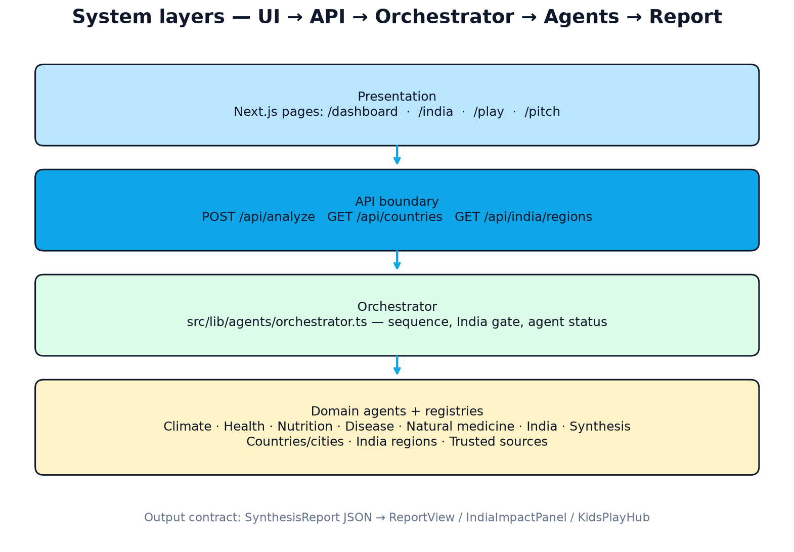

# KlimaGuard Kids

<p align="center">
  
</p>

<p align="center">
  <strong>Open-source, agentic AI platform for child-centric climate health preparedness</strong>
</p>

<p align="center">
  <a href="LICENSE"></a>
  <a href="https://github.com/carbonintelli/ClimateResilienceChildHealth/actions"></a>
  
  
  
  
  
  
</p>

---

KlimaGuard Kids connects live climate data with health, nutrition, and disease intelligence through **eight cooperating AI agents** — turning raw forecasts into age-appropriate guidance and **quantified child health impact scores** for Indian regions.

## What it does

### Global agents (all countries)

1. **Climate Data Agent** — live weather and air quality from [Open-Meteo](https://open-meteo.com/)
2. **Health Risk Agent** — heat, respiratory, flood, and vector stressors (WHO-aligned heuristics)
3. **Nutrition & Food Security Agent** — hydration, food safety, drought/flood nutrition impacts
4. **Disease Outlook Agent** — waterborne, vector-borne, and heat illness preparedness
5. **Natural Medicine Agent** — evidence-tagged supportive remedies under caregiver supervision
6. **Synthesis Agent** — cross-agent correlation and age-banded guidance (ages 5–8, 9–12, 13–17)

### India-specific agents

7. **India Regional Context Agent** — interprets monsoon cycles, climate zones, and state-level child vulnerability across **77 Indian regions** (Tier 1–3 metros, hubs, and district centres)
8. **India Child Health Impact Agent** — measures the **Child Health Impact Score (CHIS)** (0–100) across five dimensions:
   - Child Heat Vulnerability Index (CHVI)
   - Child Respiratory Burden Score (CRBS)
   - Waterborne Disease Pressure Index (WDPI)
   - Vector-Borne Disease Pressure (VBDP)
   - Climate Nutrition Stress Index (CNSI)

All formulas are **transparent and open-source** in `src/lib/agents/india-impact-agent.ts`.

### Age-based kids play

`/play` turns preparedness tips into checkable missions matched to age:

| Ages | Mode | Currency | Feel |
|------|------|----------|------|
| 5–8 | Little Climate Heroes | Stars | Short, playful quests + sticker-style badges |
| 9–12 | Climate Cadets | Points | Practical missions + level titles |
| 13–17 | Impact Leaders | Impact XP | Peer/community actions + leadership badges |

Progress (XP, badges, streaks) is stored in the browser only — no child accounts. Optional climate unlocks pull live guidance from the agent pipeline for the selected place.

## Quick start

```bash
git clone https://github.com/carbonintelli/ClimateResilienceChildHealth.git
cd ClimateResilienceChildHealth
npm install
npm run dev
```

Open [http://localhost:3000](http://localhost:3000):

- **Kids play** — age-based missions, badges, and streaks (5–8 / 9–12 / 13–17)
- **Dashboard** — global analysis across climate-vulnerable countries and cities
- **India** — regional child health impact analysis across 77 Tier 1–3 cities

## API

| Endpoint | Method | Description |
|----------|--------|-------------|
| `/api/countries` | GET | List supported countries with tiered city presets and source counts |
| `/api/india/regions` | GET | List 77 Indian regions with tier and climate metadata |
| `/api/analyze` | POST | Run full agent pipeline (`countryCode`, optional `cityId` or India `regionId`) |

### Analyze a vulnerable city

```bash
curl -X POST http://localhost:3000/api/analyze \
  -H "Content-Type: application/json" \
  -d '{"countryCode": "BD", "cityId": "chattogram"}'
```

### Analyze India region

```bash
curl -X POST http://localhost:3000/api/analyze \
  -H "Content-Type: application/json" \
  -d '{"countryCode": "IN", "regionId": "mumbai"}'
```

### Supported India regions

**Tier 1 metros:** Delhi NCR, Mumbai, Bengaluru, Hyderabad, Chennai, Kolkata, Ahmedabad, Pune

**Tier 2 hubs (selected):** Lucknow, Jaipur, Kochi, Surat, Bhubaneswar, Visakhapatnam, Indore, Guwahati, Mysuru, Nashik, Prayagraj, Vijayawada, Imphal, Agartala, Shillong, Shimla, and more

**Tier 3 centres (selected):** Patna, Ranchi, Srinagar, Kanpur, Agra, Jodhpur, Muzaffarpur, Gaya, Udaipur, Kota, Bikaner, Warangal, Kozhikode, Solapur, Aizawl, Kohima, Itanagar, and more

Full list: `GET /api/india/regions` or `src/lib/india-regions.ts`.

### Global city tiers

| Tier | Role | Approx. count |
|------|------|--------------:|
| 1 — Metro hubs | Capitals and primary metros | 168 |
| 2 — Emerging cities | Secondary / provincial hubs | 163 |
| 3 — Regional centres | District, coastal, frontier centres | 151 |

## Data sources & geography

Live weather/AQ comes from Open-Meteo. Reports cite a broader catalogue of **~50 validated sources** (WHO/UNICEF/UNDRR, FAO/WFP/IPC/FEWS NET, Copernicus/NASA POWER/CHIRPS, WRI Aqueduct, regional CDC/PAHO/CIMH/SPREP, India IMD/CPCB/NFHS-5/NVBDCP/IDSP/NCDC, and more).

**[docs/DATA_SOURCES_AND_GEOGRAPHY.md](docs/DATA_SOURCES_AND_GEOGRAPHY.md)** — full tier model, registry counts, source families, and agent provenance wiring.

## Tech stack

- Next.js 15 (App Router), React 19, TypeScript, Tailwind CSS 4
- Live data: Open-Meteo Forecast + Air Quality APIs (no API key required)
- Validated references: see `src/lib/sources.ts` and the geography/sources doc above

## Design & architecture

- **[docs/ARCHITECTURE.md](docs/ARCHITECTURE.md)** — concise design/architecture with diagrams  
- **[docs/DATA_SOURCES_AND_GEOGRAPHY.md](docs/DATA_SOURCES_AND_GEOGRAPHY.md)** — countries, cities, tiers, and trusted sources  
- **[docs/KGK_Technical_Commendation.pdf](docs/KGK_Technical_Commendation.pdf)** — rich-text technical commendation (capabilities, APIs, safeguarding, deployment, licensing); regenerate with `python3 docs/generate_kgk_technical_commendation.py`
- **[UNGM/submission/](UNGM/submission/)** — Sustainow Technologies bid pack for UNICEF Venture Fund `RFPS-NYH-2026-503931` (KlimaGuard Kids); regenerate with `python3 UNGM/fill_sustainow_bid.py`

<p align="center">
  
</p>

Diagrams can be regenerated with `python3 docs/generate_architecture_diagrams.py`.

## Contributing

We welcome contributions! See [CONTRIBUTING.md](CONTRIBUTING.md) for setup, coding standards, and how to add new regions or agents.

## Open source

This project is released under the [MIT License](LICENSE). You are free to use, modify, and distribute it.

## Disclaimer

KlimaGuard Kids is a community preparedness tool, not a medical diagnostic system. Always consult qualified healthcare providers for clinical decisions.
