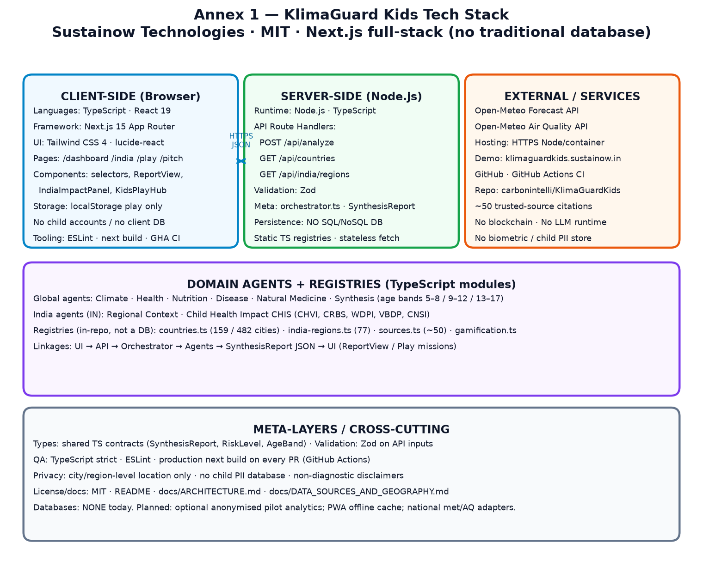
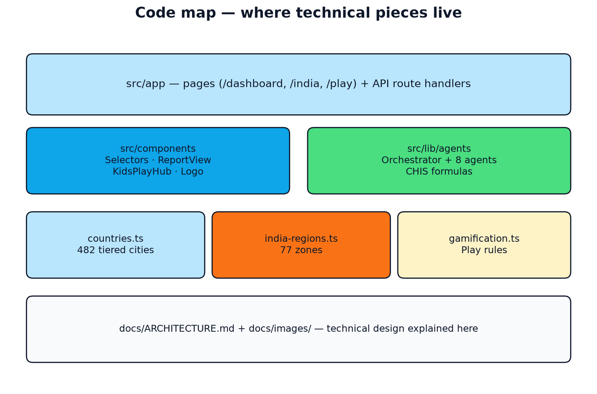

# KlimaGuard Kids — Design & Architecture

Brief technical overview of how the product is designed and how the system fits together. Diagrams below live in [`docs/images/`](images/) and can be regenerated with:

```bash
python3 docs/generate_architecture_diagrams.py
```

## Design goals

1. **Child-first preparedness** — outputs are age-banded (5–8, 9–12, 13–17), not clinical diagnosis.
2. **Transparent agents** — each “agent” is a pure TypeScript module with clear inputs/outputs and cited sources (not opaque LLM calls in the demo pipeline).
3. **Live climate, heuristic health** — weather/AQ come from Open-Meteo; health/nutrition/disease layers apply documented heuristics aligned with public guidance.
4. **Global reach, India depth** — any supported city runs the global pipeline; India adds regional context and a measurable Child Health Impact Score (CHIS).
5. **Low friction for kids** — play-mode progress stays in the browser (`localStorage`); no child accounts required for the demo.

## High-level architecture

<p align="center">
  
</p>

```text
UI pages  →  Route handlers  →  Orchestrator  →  Agents  →  SynthesisReport  →  UI
```

## Stack

<p align="center">
  
</p>

| Layer | Choice |
|--------|--------|
| App | Next.js 15 (App Router), React 19, TypeScript, Tailwind CSS 4 |
| API validation | Zod |
| Live climate | Open-Meteo Forecast + Air Quality (no API key) |
| Agents | Pure TS functions under `src/lib/agents/` (deterministic heuristics — **not** LLM calls in the core pipeline) |
| Registries | `countries.ts` (~159 countries / ~482 tiered cities), `india-regions.ts` (77 zones), `sources.ts` (~50 validated feeds) |
| Persistence | **No traditional SQL/NoSQL database** in the demo architecture (stateless analyze + in-repo registries) |
| Play progress | Browser `localStorage` only (no child accounts / no child PII store) |
| Quality | TypeScript strict, ESLint, `next build` on GitHub Actions |
| License | MIT |

## Repository layout

<p align="center">
  
</p>

```text
src/
├── app/                 # Pages + API route handlers
│   ├── dashboard/       # Global country/city analysis UI
│   ├── india/           # India CHIS dashboard
│   ├── play/            # Age-based missions / badges
│   ├── pitch/           # Stakeholder narrative
│   └── api/             # analyze, countries, india/regions
├── components/          # Client UI (selectors, ReportView, play hub)
└── lib/
    ├── agents/          # Orchestrator + 8 domain agents
    ├── countries.ts     # Vulnerable countries & city presets
    ├── india-regions.ts # India tier/zone metadata
    ├── gamification.ts  # Age profiles, missions, badges
    ├── sources.ts       # Provenance labels
    └── types.ts         # Shared contracts (SynthesisReport, etc.)
```

## Analyze request flow

<p align="center">
  
</p>

1. UI posts `{ countryCode, cityId? }` or `{ countryCode: "IN", regionId }`.
2. `/api/analyze` validates with Zod, resolves lat/lon from the city or India region registry.
3. `runAgentPipeline()`:
   - Fetches climate (network; failure fails the request).
   - Runs health, nutrition, and disease heuristics in parallel.
   - Runs natural-medicine matching.
   - If India: regional context → CHIS dimensions/composite.
   - Synthesis builds correlations and three age-band guidance cards.
4. UI renders `SynthesisReport` (and play mode can turn guidance into missions).

## Agent model

<p align="center">
  
</p>

| Agent | Scope | Role |
|--------|--------|------|
| Climate | Global | Live weather, heat index, precipitation, AQI |
| Health | Global | Heat / respiratory / flood / vector stressors |
| Nutrition | Global | Hydration, food safety, scarcity notes |
| Disease | Global | Transmission, precautions, illness profiles |
| Natural medicine | Global | Supportive remedies with caregiver cautions |
| India regional | India | Monsoon, climate zone, regional child risks |
| India impact | India | CHIS (CHVI, CRBS, WDPI, VBDP, CNSI) 0–100 |
| Synthesis | Global | Cross-agent correlations + age-banded cards |

India agents activate only when `countryCode === "IN"`. Formulas for CHIS live in `src/lib/agents/india-impact-agent.ts`.

### India CHIS dimensions

<p align="center">
  
</p>

## Data & registries

<p align="center">
  
</p>

Full catalogue and tier definitions: **[DATA_SOURCES_AND_GEOGRAPHY.md](DATA_SOURCES_AND_GEOGRAPHY.md)**.

| Registry | Count (demo) | Notes |
|----------|-------------:|-------|
| Countries | 159 | ISO code, name, flag |
| Global cities | 482 | Tier 1–3 + `primaryRisks`; ≈168 / 163 / 151 |
| India regions | 77 | Tier 1–3 + climate zone / monsoon / CHIS inputs (8 / 33 / 36) |
| Trusted sources | 50 | Live Open-Meteo + validated reference frameworks |

- **Countries / cities** — `CITIES_BY_COUNTRY` holds multi-city presets with urban `tier` (1–3) and `primaryRisks` tags; `getCityPreset(code, cityId)` resolves coordinates for analyze. UI groups cities by tier.
- **India regions** — separate from the global city list; dashboard shows `IndiaRegionSelector` for India deep CHIS coverage.
- **Trusted sources** — `sources.ts` attaches provenance to agent status. Live fetch is Open-Meteo; WHO/UNICEF/UNDRR, FAO/IPC/FEWS, Copernicus/NASA/CHIRPS, regional CDC/PAHO/CIMH/SPREP, and India IMD/NFHS/etc. frame heuristics and report citations.

## Client vs server

<p align="center">
  
</p>

| Runs on server | Runs in the browser |
|----------------|---------------------|
| `/api/*` route handlers | Dashboard, India, Play pages |
| All agent modules | Selectors, `ReportView`, `KidsPlayHub` |
| Registry lookups for analyze | Gamification XP / badges / streaks |

Outbound network from the demo pipeline is Open-Meteo (climate agent). Analysis is always requested via `fetch("/api/analyze")` so agent logic stays server-side.

## UI surfaces & kids play

| Route | Purpose |
|--------|---------|
| `/` | Product entry, CTAs |
| `/dashboard` | Country + city → full agent report (tabbed: Overview / India / Agents / Care / Kids) |
| `/india` | Region → CHIS + India panels (same tabbed report) |
| `/play` | Age-tiered missions powered by guidance (optional climate unlock) |
| `/pitch` | Narrative / stakeholder overview |

<p align="center">
  
</p>

## Privacy, safety, and AI posture

| Topic | Current design |
|--------|----------------|
| Child accounts | None required |
| PII in core analyze flow | City/region selection only — no names, phones, school IDs, or health records |
| Play progress | Device `localStorage` only |
| Core “agentic” scoring | Deterministic TypeScript heuristics (audit-friendly); **not** generative LLM scoring |
| Clinical claims | Non-diagnostic preparedness tool; caregiver/CHW framing + disclaimers |
| Blockchain | Not used |

Any future optional LLM assist would be adult-facing, sandboxed, and must not replace transparent CHIS / heuristic scores without evaluation.

## Near-term product roadmap (investment period)

Aligned with UNICEF Venture Fund design plan (see [UNGM_Template3_Product_Design_Plan.md](UNGM_Template3_Product_Design_Plan.md)):

1. Multilingual UI (≥3 languages) and accessibility hardening  
2. Offline-capable PWA shell + last-good climate cache  
3. Public real-time investment KPI endpoint/dashboard + anonymised analytics (no child PII)  
4. National met/AQ adapter interface (India IMD/CPCB-ready)  
5. DHIS2 aggregate-indicator interoperability spike  
6. School/CHW pilots with midline/endline evidence pack  

## Design notes for contributors

- Prefer **deterministic, documented heuristics** over hidden model calls for core health scoring.
- Keep child copy **age-appropriate**; synthesis already splits tone by band.
- When adding geography, update registries only — orchestrator and selectors pick them up automatically (see [CONTRIBUTING.md](../CONTRIBUTING.md)).
- Play mode must remain **privacy-light** (device-local progress, no required child accounts).
- Regenerate diagrams after major pipeline changes: `python3 docs/generate_architecture_diagrams.py`.
- After registry size changes, refresh counts in README, this file, [DATA_SOURCES_AND_GEOGRAPHY.md](DATA_SOURCES_AND_GEOGRAPHY.md), and the technical commendation source.

## Related docs

- [README.md](README.md) — documentation index  
- [DATA_SOURCES_AND_GEOGRAPHY.md](DATA_SOURCES_AND_GEOGRAPHY.md) — tiers, registry counts, validated sources, agent provenance  
- [KGK_Technical_Commendation.pdf](KGK_Technical_Commendation.pdf) — rich-text technical commendation / capability statement  
- [../README.md](../README.md) — product overview, quick start, API table  
- [../CONTRIBUTING.md](../CONTRIBUTING.md) — how to add countries, cities, regions, agents  
- [UNGM_Template3_Product_Design_Plan.md](UNGM_Template3_Product_Design_Plan.md) — 12-month design/data plan  
- `images/tech-stack-annex1.png` · `curriculum-map-annex3.png` · `content-sample-annex4.png` — UNGM annex visuals  
- `Training/` — longer narrative and additional presentation diagram assets  
