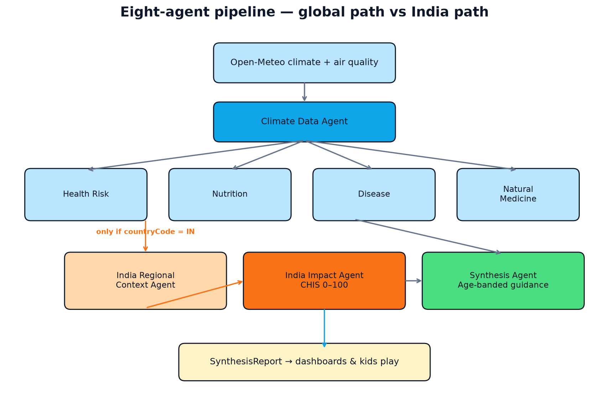
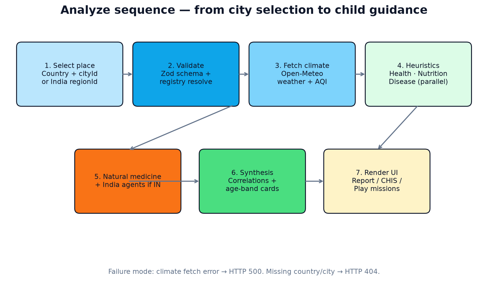
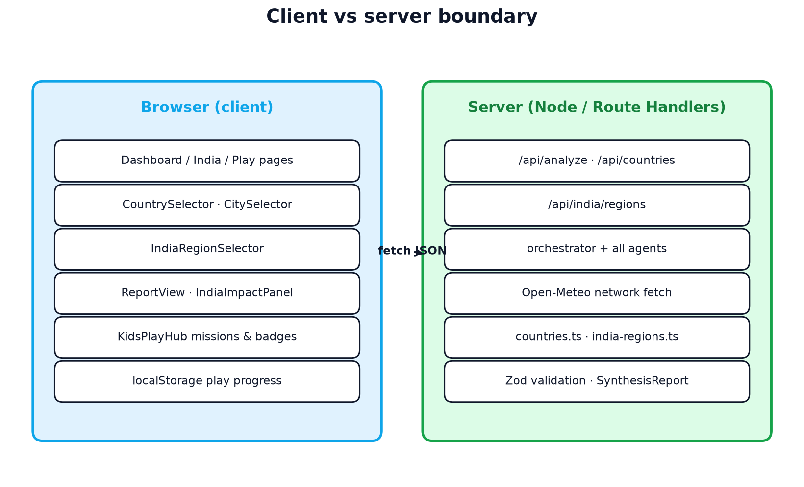
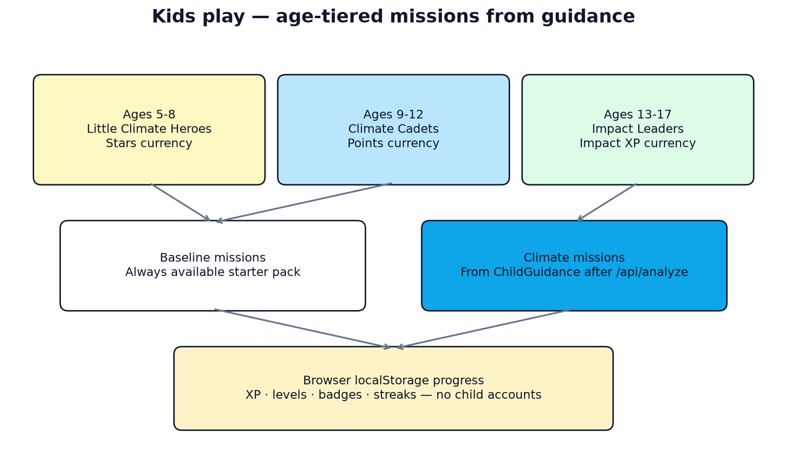
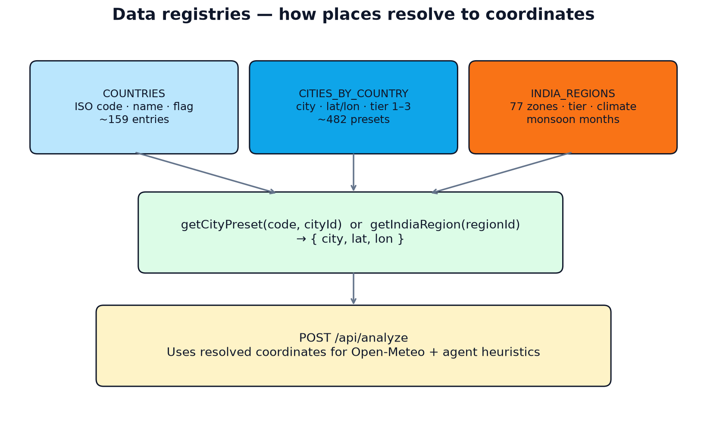
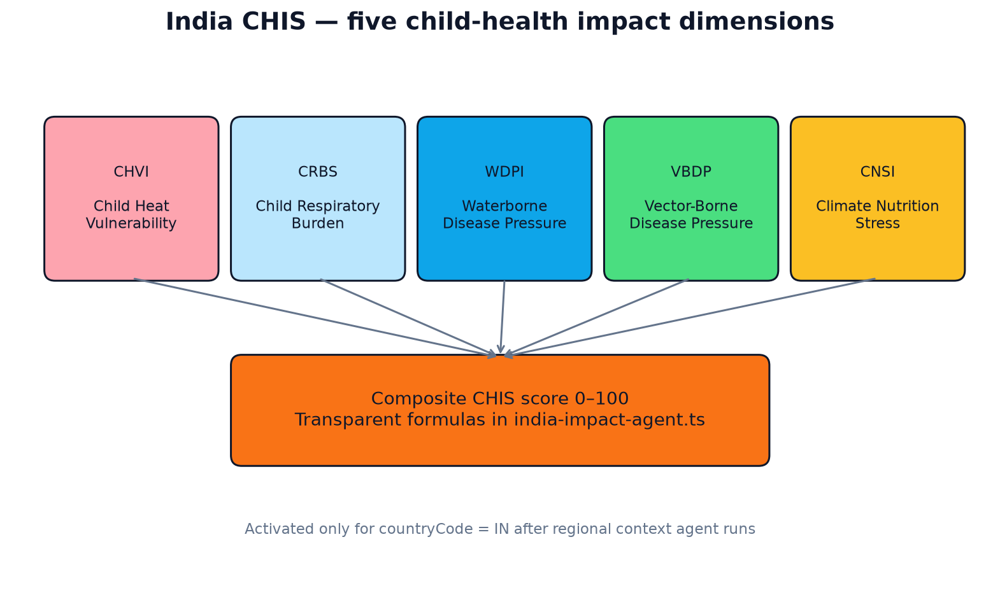

# KlimaGuard Kids
## KGK Technical Commendation

| Field | Detail |
|--------|--------|
| **Document title** | KlimaGuard Kids — KGK Technical Commendation |
| **Product name** | KlimaGuard Kids |
| **Supplier / developer** | Sustainow Technologies |
| **Document version** | 1.0 |
| **Software version** | 0.2.0 |
| **License** | MIT (open source) |
| **Primary repository** | https://github.com/carbonintelli/KlimaGuardKids |
| **Document date** | 2026-08-02 |
| **Classification (indicative UNSPSC)** | 43230000 Software; 81112200 Software maintenance and support; 77101500 Environmental management; 85101705 Public health administration |

> **Purpose of this document**  
> This document provides a clear technical description of KlimaGuard Kids (KGK) for procurement, ICT, programme, partner, and evaluation reviewers. It serves as the product technical commendation and capability statement.

---

## 1. Executive summary

**KlimaGuard Kids** is an open-source, web-based platform that converts live climate and air-quality signals into **child-centred health preparedness guidance**. It uses eight cooperating software “agents” (deterministic TypeScript modules) to analyse heat, air quality, flood/drought pressure, nutrition stress, and disease risk, then produces:

1. Location-specific climate–health briefings for caregivers, schools, and community health workers  
2. Age-banded guidance for children (ages 5–8, 9–12, 13–17)  
3. For India, a transparent **Child Health Impact Score (CHIS)** across five measurable dimensions  
4. An optional age-appropriate **play / mission** layer to reinforce preparedness behaviours  

The platform is designed for **anticipatory action**, not clinical diagnosis. All core measurement logic is inspectable in source code. Live weather and air-quality inputs are drawn from Open-Meteo; health framing references WHO and national public-health guidance.

**Coverage (demo registry):**

| Scope | Count |
|--------|------:|
| Climate-vulnerable countries | 159 |
| High-risk city presets (Tier 1–3) | 482 |
| India regional zones (deep coverage) | 77 |
| Validated / trusted data sources | 50 |

---

## 2. Problem statement and development relevance

Climate change intensifies heatwaves, flooding, air pollution, vector-borne disease, and food insecurity. Children are disproportionately affected because of physiology, dependency on caregivers, and disruption to school and nutrition routines. Most climate tools speak to policymakers; few deliver **actionable, age-appropriate guidance** that local actors can use within days.

KlimaGuard Kids addresses this gap by:

- Connecting **near-real-time climate data** to child-health heuristics  
- Presenting outputs in language suitable for children and supervising adults  
- Providing a **quantified India impact score** for regional prioritisation  
- Remaining **open source (MIT)** so UN entities, governments, NGOs, and local partners can adapt, host, and extend it  

### 2.1 Sustainable Development Goal alignment

| SDG | Contribution |
|-----|----------------|
| **SDG 3** — Good health and well-being | Anticipatory guidance for climate-sensitive child health risks |
| **SDG 13** — Climate action | Child-centred early-warning and preparedness intelligence |
| **SDG 2** — Zero hunger | Nutrition and food-security stress signals under climate disruption |
| **SDG 4** — Quality education | School-ready heat/flood/air guidance and peer-educator missions for teens |
| **SDG 11** — Sustainable cities | City- and region-level vulnerability views for local planning |

---

## 3. Solution overview

### 3.1 What the product delivers

| Capability | Description |
|------------|-------------|
| Global dashboard | Select a vulnerable country and city; run the full agent pipeline; view risks, correlations, and child guidance |
| India dashboard | Select one of 77 regions; view regional monsoon/zone context and CHIS composite + dimension scores |
| Kids play mode | Age-tiered missions, badges, levels, and streaks derived from preparedness tips (browser-local progress) |
| Machine-readable API | REST endpoints for countries, India regions, and full analysis reports (JSON) |
| Provenance | Each agent run cites trusted data/reference sources |

### 3.2 What the product is **not**

- Not a medical diagnostic or telemedicine system  
- Not a substitute for clinical care, emergency services, or national early-warning authorities  
- Not a system that requires child accounts or stores children’s personal health records in the demo architecture  

### 3.3 Intended users

| User group | Typical use |
|------------|-------------|
| Community health workers / frontline staff | Quick location briefings before heat/flood/vector seasons |
| Teachers and school administrators | Age-appropriate preparedness messaging |
| Caregivers and youth (supervised) | Play missions and simple guidance cards |
| Programme / UN / NGO officers | Situational awareness, demo for pilots, adaptation of open code |
| Local technologists | Extend registries, deploy in-country, integrate APIs |

---

## 4. Technical architecture

Detailed diagrams are provided in [`docs/ARCHITECTURE.md`](ARCHITECTURE.md) and [`docs/images/`](images/).

### 4.1 Architectural style

KlimaGuard Kids is a **modern web application** with:

- **Presentation layer** — Next.js App Router pages (React)  
- **API layer** — Next.js Route Handlers (`/api/*`) with Zod validation  
- **Domain layer** — Orchestrated agent pipeline in TypeScript  
- **Data layer** — Static geographic registries + live Open-Meteo climate/AQ fetch  

```text
Browser UI  →  HTTPS JSON APIs  →  Orchestrator  →  Agents  →  SynthesisReport  →  UI
```

<p align="center">
  
</p>

### 4.2 Technology stack

| Layer | Technology | Rationale |
|--------|------------|-----------|
| Application framework | Next.js 15 (App Router) | Unified UI + API, strong TypeScript support |
| UI | React 19, Tailwind CSS 4 | Accessible, responsive interfaces |
| Language | TypeScript (strict) | Type-safe contracts for reports and APIs |
| Validation | Zod | Explicit request schemas for `/api/analyze` |
| Live climate data | Open-Meteo Forecast & Air Quality APIs | Public, no API key required for demo scale |
| Quality gates | ESLint + `next build` via GitHub Actions CI | Automated lint/build on every push/PR |
| License | MIT | Permissive reuse by UN system and partners |

### 4.3 Agent pipeline (eight agents)

<p align="center">
  
</p>

| # | Agent | Scope | Function |
|---|--------|--------|----------|
| 1 | Climate Data Agent | Global | Fetches temperature, humidity, precipitation, heat index, AQI |
| 2 | Health Risk Agent | Global | Maps climate signals to heat, respiratory, flood, vector stressors |
| 3 | Nutrition & Food Security Agent | Global | Hydration targets, food safety, scarcity notes |
| 4 | Disease Outlook Agent | Global | Transmission pathways, precautions, illness profiles |
| 5 | Natural Medicine Agent | Global | Evidence-tagged supportive home remedies under adult supervision |
| 6 | India Regional Context Agent | India only | Monsoon, climate zone, regional child vulnerability |
| 7 | India Child Health Impact Agent | India only | Computes CHIS (0–100) across five dimensions |
| 8 | Synthesis Agent | Global | Cross-agent correlations + age-banded child guidance cards |

**Important design choice:** In the current demo pipeline, agents are **deterministic TypeScript modules** with documented heuristics—not opaque large-language-model calls. This supports auditability, reproducibility, and offline/local adaptation.

### 4.4 Request processing flow

<p align="center">
  
</p>

1. User selects a country + city (or an India region).  
2. Client calls `POST /api/analyze` with `{ countryCode, cityId? }` or `{ countryCode: "IN", regionId }`.  
3. Server validates input (Zod) and resolves latitude/longitude from registries.  
4. Orchestrator fetches climate data; on failure returns HTTP 500.  
5. Health, nutrition, and disease agents run in parallel; natural-medicine follows.  
6. If India: regional context → CHIS impact scoring.  
7. Synthesis assembles `SynthesisReport` JSON.  
8. UI renders dashboards; play mode may convert guidance into missions.

### 4.5 Client–server boundary

<p align="center">
  
</p>

| Server-side | Client-side |
|-------------|-------------|
| All agent computation | Dashboards, selectors, report rendering |
| Open-Meteo network fetch | Kids play interactions |
| Registry resolution for analysis | Play XP/badges/streaks in `localStorage` |
| API validation and error responses | No child account system in demo |

---

## 5. Functional modules and user interfaces

| Route | Module | Description |
|--------|--------|-------------|
| `/` | Landing | Product introduction and entry points |
| `/dashboard` | Global analysis | Country + vulnerable-city selection; full report |
| `/india` | India CHIS | 77-region selector; impact panel and guidance |
| `/play` | Kids play | Age bands 5–8 / 9–12 / 13–17; missions and badges |
| `/pitch` | Stakeholder brief | Narrative overview for partners |

### 5.1 Age-banded child guidance

The Synthesis Agent produces three guidance cards per analysis:

| Age band | Tone | Example focus |
|----------|------|----------------|
| 5–8 | Playful, simple | Shade, water sips, handwashing |
| 9–12 | Practical briefing | Forecast checks, cooler routes, peer reminders |
| 13–17 | Leadership / community | Buddy checks, verified alert sharing, peer education |

### 5.2 Kids play (behaviour reinforcement)

<p align="center">
  
</p>

| Ages | Mode name | Currency | Progress storage |
|------|-----------|----------|------------------|
| 5–8 | Little Climate Heroes | Stars | Browser only |
| 9–12 | Climate Cadets | Points | Browser only |
| 13–17 | Impact Leaders | Impact XP | Browser only |

Missions can use a starter pack or unlock from live `ChildGuidance` after climate analysis. **No child accounts** are required for the demo.

---

## 6. Data sources, geography, and methodology

### 6.1 Trusted sources

Live operational fetch today uses Open-Meteo. Remaining entries are authoritative reference frameworks that ground agent heuristics, India CHIS notes, and UN-aligned provenance (see `src/lib/sources.ts` for the full catalogue of ~50 sources).

| Source family | Examples | Use in platform |
|---------------|----------|-----------------|
| Live weather / AQ | Open-Meteo Forecast & Air Quality | Near-real-time temperature, precip, humidity, AQI |
| Climate EO / forecast | Copernicus CDS, NASA POWER, CHIRPS, ECMWF, NOAA CPC, ClimateSERV | Climate context and early-warning framing |
| UN health & child rights | WHO heat–health / WASH / GHO, UNICEF CCRI / WASH / MICS | Child-health and WASH heuristics |
| Disaster & adaptation | UNDRR Sendai, INFORM, ND-GAIN, EM-DAT, ReliefWeb | Risk and vulnerability framing |
| Food security | FAO / GIEWS, WFP, IPC, FEWS NET | Nutrition and scarcity stress framing |
| Water / development | WRI Aqueduct, World Bank Climate Portal | Water-stress context |
| Regional health / met | PAHO, Africa CDC, ECDC, CIMH, SPREP, Met Office, BoM, JMA, US CDC | Region-specific disease and climate services |
| Humanitarian context | ACAPS, UNHCR climate, IOM DTM | Displacement and crisis vulnerability |
| India national | IMD, CPCB, NFHS-5, NVBDCP, IDSP, NCDC | India regional and CHIS scoring context |

### 6.2 Geographic registries

<p align="center">
  
</p>

| Registry | Location in code | Contents |
|----------|------------------|----------|
| Countries | `src/lib/countries.ts` | 159 ISO countries with flags |
| Cities | `CITIES_BY_COUNTRY` in same file | 482 city presets with lat/lon, urban tier (1–3), and primary risk tags |
| India regions | `src/lib/india-regions.ts` | 77 zones with tier, climate zone, monsoon months, primary risks |
| Trusted sources | `src/lib/sources.ts` | ~50 validated feeds and reference frameworks |

City presets emphasise climate-vulnerable locations (heat, flood, cyclone/typhoon, drought, air pollution, sea-level, vector pressure) across metro (Tier 1), emerging (Tier 2), and district/frontier (Tier 3) centres. India retains a dedicated regional model for deeper CHIS analysis.

For the maintained catalogue (tier definitions, helper functions, source families, and orchestrator provenance mapping), see [`DATA_SOURCES_AND_GEOGRAPHY.md`](DATA_SOURCES_AND_GEOGRAPHY.md).

### 6.3 India Child Health Impact Score (CHIS)

<p align="center">
  
</p>

CHIS is a **0–100 composite** (higher = greater climate-related child-health burden) with five dimensions:

| Code | Dimension | Focus |
|------|-----------|--------|
| CHVI | Child Heat Vulnerability Index | Extreme heat days, heat index, aridity |
| CRBS | Child Respiratory Burden Score | AQI and air-pollution pressure |
| WDPI | Waterborne Disease Pressure Index | Flood / water-contamination pressure |
| VBDP | Vector-Borne Disease Pressure | Conditions favouring vector risk |
| CNSI | Climate Nutrition Stress Index | Climate-linked nutrition/food stress |

Formulas are transparent and open source in `src/lib/agents/india-impact-agent.ts`. Risk bands used in UI: low / moderate / high / critical.

---

## 7. Application programming interfaces (APIs)

Base URL (local demo): `http://localhost:3000`

| Endpoint | Method | Description |
|----------|--------|-------------|
| `/api/countries` | GET | Countries with nested city presets and registry counts |
| `/api/india/regions` | GET | 77 Indian regions with metadata |
| `/api/analyze` | POST | Runs full agent pipeline; returns `SynthesisReport` |
| `/api/analyze` | GET | Service metadata (agents, country/city/region counts) |

### 7.1 Example — analyse a vulnerable city

```bash
curl -X POST http://localhost:3000/api/analyze \
  -H "Content-Type: application/json" \
  -d '{"countryCode": "BD", "cityId": "chattogram"}'
```

### 7.2 Example — analyse an India region

```bash
curl -X POST http://localhost:3000/api/analyze \
  -H "Content-Type: application/json" \
  -d '{"countryCode": "IN", "regionId": "mumbai"}'
```

### 7.3 Interoperability notes

- Responses are **JSON** suitable for integration into dashboards, SMS gateways (via partner middleware), or national platforms.  
- Optional overrides: `city`, `lat`, `lon` may be supplied to analyse coordinates beyond the demo registry.  
- No proprietary binary protocols; standard HTTPS/JSON only.

---

## 8. Security, privacy, and child safeguarding

| Topic | Current demo posture |
|--------|----------------------|
| Authentication | Public demo; no end-user login required |
| Child accounts | **Not used** — play progress is device-local (`localStorage`) |
| Personal data | Analysis uses country/city/region only; no name, phone, school, or health-record collection in core flow |
| Server-side storage of chat/PII | Not part of current architecture (chat/scheduling removed) |
| Transport | Deploy behind HTTPS in production |
| Secrets | Open-Meteo demo path requires no API key; production integrations should use environment-managed credentials if added |
| Safeguarding principle | Outputs are educational/preparedness guidance; clinical decisions require qualified providers |
| Future compliance path | COPPA / GDPR-K / national child-data laws for any future account or messaging features |

**Disclaimer for procurement reviewers:** KlimaGuard Kids is a **community preparedness and decision-support tool**, not a medical device and not a diagnostic system.

---

## 9. Deployment, hosting, and operational requirements

### 9.1 Minimum runtime

| Requirement | Specification |
|-------------|----------------|
| Runtime | Node.js 22 (CI baseline) |
| Package manager | npm |
| Build | `npm ci && npm run build` |
| Start | `npm start` (or `npm run dev` for development) |
| Outbound network | Access to Open-Meteo endpoints for live analysis |

### 9.2 Typical deployment options

- Cloud VM / container (Dockerisable Next.js app)  
- Managed Node hosting (e.g. Vercel, equivalent UN/partner cloud)  
- On-premises / in-country government cloud for data-sovereignty pilots  

### 9.3 Quality assurance

Automated CI (GitHub Actions) on `main` and pull requests:

1. `npm ci`  
2. `npm run lint`  
3. `npm run build`  

### 9.4 Extensibility for UN programmes

Partners can:

- Add countries/cities in `src/lib/countries.ts`  
- Add India (or analogous national) regions in dedicated registries  
- Register new agents in `src/lib/agents/` + orchestrator  
- Re-skin UI for local languages (i18n roadmap)  
- Replace Open-Meteo with authenticated national meteorological feeds  

See [`CONTRIBUTING.md`](../CONTRIBUTING.md).

---

## 10. Intellectual property, licensing, and openness

| Item | Detail |
|------|--------|
| Copyright | © 2026 Sustainow Technologies |
| License | MIT License — use, modification, redistribution permitted |
| Source availability | Full application source on GitHub |
| Third-party data | Open-Meteo and public reference sources retain their own terms; platform cites provenance |
| Brand assets | Product logo and documentation diagrams included in repository |

Open licensing is intentional: UN entities and implementing partners can fork, audit, localise, and redeploy without proprietary lock-in for the core demo codebase.

---

## 11. Implementation support model (indicative)

For UNGM capability statements, the following support tiers are typical (commercial terms negotiated per engagement):

| Tier | Scope |
|------|--------|
| **Open-source self-serve** | Public repo, documentation, community issues |
| **Pilot support** | Deployment assistance, registry customisation, training for programme staff |
| **Country adaptation** | Local language UI, national met/health feed integration, hosting hardening |
| **Scale / LTA-ready** | SLA-backed hosting advice, monitoring, change management, knowledge transfer |

Training assets are also available under `Training/` (marketing/training manual and diagrams).

---

## 12. Risks, limitations, and roadmap

### 12.1 Current limitations

- Heuristic health models are **decision-support**, not epidemiological forecasting validated for clinical use  
- Global city registry is a curated demo set (482 cities across Tier 1–3), not exhaustive  
- India has deeper quantitative scoring than other countries today  
- Multilingual UI and offline-first modes are roadmap items  
- Production authentication, RBAC, and enterprise SSO are not in the public demo  

### 12.2 Indicative roadmap

1. Local language packs and accessibility hardening  
2. Optional authenticated national weather/AQ feeds  
3. Expanded non-India quantitative impact modules  
4. Partner SMS/USSD or WhatsApp bridges via middleware (privacy-reviewed)  
5. Field evaluation with ministries of health/education and UN programme partners  

---

## 13. Document map for reviewers

| Document | Contents |
|----------|----------|
| **This file** (`docs/KGK_Technical_Commendation.pdf`) | KGK technical commendation / capability statement |
| [`docs/ARCHITECTURE.md`](ARCHITECTURE.md) | Concise design/architecture with diagrams |
| [`docs/DATA_SOURCES_AND_GEOGRAPHY.md`](DATA_SOURCES_AND_GEOGRAPHY.md) | Tiers, registry counts, validated sources, agent provenance |
| [`docs/images/`](images/) | Technical diagrams (system layers, pipeline, CHIS, etc.) |
| [`README.md`](../README.md) | Product overview and quick start |
| [`CONTRIBUTING.md`](../CONTRIBUTING.md) | How to extend geography, sources, and agents |
| [`LICENSE`](../LICENSE) | MIT licence text |
| `Training/` | Longer narrative and presentation assets |

### 13.1 Diagram index

| File | Explains |
|------|----------|
| `docs/images/system-layers.png` | UI → API → orchestrator → agents |
| `docs/images/analyze-sequence.png` | End-to-end analyse request steps |
| `docs/images/agent-pipeline.png` | Global vs India agent flow |
| `docs/images/client-server.png` | Browser vs server responsibilities |
| `docs/images/data-registries.png` | Country/city/India resolution |
| `docs/images/chis-dimensions.png` | CHIS five dimensions |
| `docs/images/play-gamification.png` | Age-tiered play model |
| `docs/images/repo-map.png` | Code ownership map |

Regenerate diagrams:

```bash
python3 docs/generate_architecture_diagrams.py
```

---

## 14. Contact and submission notes

| Item | Detail |
|------|--------|
| Supplier | Sustainow Technologies |
| Product | KlimaGuard Kids |
| Repository | https://github.com/carbonintelli/KlimaGuardKids |
| Licence | MIT |

**Distribution guidance:** Use this PDF (`docs/KGK_Technical_Commendation.pdf`) as the official KlimaGuard Kids technical commendation for partner, procurement, and programme submissions. Diagrams in `docs/images/` are embedded below where relevant.

---

*End of KGK Technical Commendation.*
